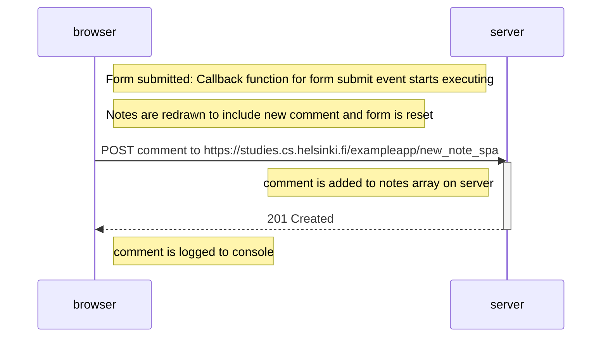

```mermaid
  sequenceDiagram
    Participant browser
    Participant server

    Note right of browser: Form submitted: Callback function for form submit event starts executing
    Note right of browser: Notes are redrawn to include new comment and form is reset
    browser->>server: POST comment to https://studies.cs.helsinki.fi/exampleapp/new_note_spa
    activate server
    Note left of server: comment is added to notes array on server 
    server-->>browser: 201 Created
    deactivate server
    Note right of browser: comment is logged to console
```